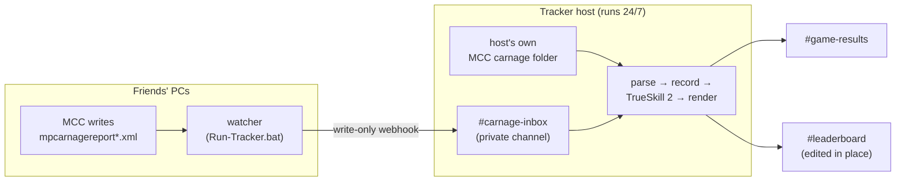

<div align="center">

# Halo 3 Customs Tracker

**Automatic match tracking, TrueSkill 2 ratings, and a live Halo 5-style CSR
leaderboard for Halo 3 custom games in MCC — posted straight to Discord.**

[](https://github.com/Hysterically/MCC-Halo-3-Custom-Games-Tracker/releases/latest)


</div>

The tracker reads the carnage report files Halo: MCC saves after each game — no
game hooks, no screen capture, and it never touches a Microsoft or Xbox
account. Every finished custom becomes a post-game carnage screen in Discord:


…and a single, always-current standings post ranks everyone with a Halo 5-style
CSR (Bronze through Onyx, with Champion for the top of the board):


*Both images are actual tracker output, rendered from fictional players.*

## Contents

- [Features](#features)
- [The rank ladder](#the-rank-ladder)
- [How it works](#how-it-works)
- [Join an existing leaderboard](#join-an-existing-leaderboard)
- [Host your own leaderboard](#host-your-own-leaderboard)
- [Configuration reference](#configuration-reference)
- [Repository layout](#repository-layout)
- [Development](#development)

## Features

- **Per-match carnage posts** — a rendered image of the post-game scoreboard
  (score, kills, assists, deaths) with each player's new CSR and rating change,
  plus a pre-match win-probability bar for rated team games.
- **Live 4v4 leaderboard** — one standings image, edited in place after every
  game, so the channel never fills with stale copies. Columns: CSR (with
  division emblem), W-L-D, win %, K/D, and peak CSR.
- **TrueSkill 2 ratings** — matches are rated with the TrueSkill 2 model and
  displayed on the familiar Halo 5 CSR ladder. Ranks rebuild deterministically
  from match history.
- **Slash commands** — `/leaderboard` and `/stats <player>` (with name
  autocomplete) answer on demand as rich embeds; admins get `/delete` (void a
  game) and `/exclude` (keep the post, drop it from the boards).
- **Weekly recap** — a Sunday-evening embed with games played, most active
  player, MVP by K/D, and the current board leaders.
- **Counted exactly once** — matches are deduplicated by the game's unique id,
  so several people can run the tracker in the same lobby safely.
- **Tiny friend install** — friends run a single self-contained
  `Run-Tracker.bat` (a zero-dependency Node 18+ watcher, plain readable source,
  no EXE). It uploads finished games through a write-only webhook and keeps
  itself up to date.
- **Local or shared storage** — SQLite on disk by default; point several hosts
  at one [Turso](https://turso.tech)/libSQL database for a single combined
  leaderboard.

## The rank ladder

CSR is a display of the underlying TrueSkill 2 rating (the conservative
`mu − 3σ` skill, scaled). Bronze through Diamond are split into sub-ranks 1–6
of 50 CSR each; Onyx shows the raw number. **Champion** is an accolade, not a
tier: up to the top 3 players on the board who are at or above 1600 CSR.

| <br>Bronze | <br>Silver | <br>Gold | <br>Platinum | <br>Diamond | <br>Onyx | <br>Champion |
|:---:|:---:|:---:|:---:|:---:|:---:|:---:|
| 0–299 | 300–599 | 600–899 | 900–1199 | 1200–1499 | 1500+ | top 3 at 1600+ |

## How it works

Two ingest paths feed one pipeline. The tracker host watches its own MCC
carnage folder directly, and (optionally) a private `#carnage-inbox` channel
that friends' watchers upload to — so the leaderboard stays current no matter
whose PC recorded the game.



The watcher never touches the database; the host does all parsing, rating, and
posting, and reacts to each upload (✅ recorded / 🔁 duplicate / ⚠️ unusable)
so the watcher can tell the tracker is alive.

## Join an existing leaderboard

For players joining a group whose leaderboard is already hosted. Requirements:
Windows 10/11, Halo: MCC, Node.js 18+.

1. **Install Node.js** if you don't have it —
   [nodejs.org](https://nodejs.org) → the LTS installer, or download
   [`Install-Node.bat`](https://github.com/Hysterically/MCC-Halo-3-Custom-Games-Tracker/releases/latest/download/Install-Node.bat)
   and let it do the work. (The watcher is plain source code rather than an
   .exe — Node.js runs it, and you can open the file and read every line.)
2. **Download
   [`Run-Tracker.bat`](https://github.com/Hysterically/MCC-Halo-3-Custom-Games-Tracker/releases/latest/download/Run-Tracker.bat)**
   and put it in its own folder anywhere. That single file is the whole
   install — nothing to extract.
3. **Add your group's upload settings** — ask whoever hosts the leaderboard
   for the group's inbox webhook line. (If your group shares a preconfigured
   copy of `Run-Tracker.bat` on Discord, it has the settings baked in already —
   grab that one and skip this step.)
4. **Double-click `Run-Tracker.bat`** whenever you play customs and leave the
   window open. Results appear in Discord on their own.

Good to know:

- One person in the lobby running it is enough — the match report lists
  everyone, and each game is counted exactly once.
- The only secret you hold is a write-only webhook URL; the watcher can't read
  the channel it posts to.
- The watcher keeps itself current: when a new version ships it offers the
  update in its own window (press <kbd>U</kbd> + <kbd>Enter</kbd>) — no
  re-downloading.

## Host your own leaderboard

The watcher only *feeds* a tracker — to run a leaderboard for your own group,
run the tracker host yourself. It's a Node/TypeScript app; the host machine
(or a cloud box) should stay up so the leaderboard does.

```sh
git clone https://github.com/Hysterically/MCC-Halo-3-Custom-Games-Tracker.git
cd MCC-Halo-3-Custom-Games-Tracker
npm install
cp .env.example .env   # then fill it in — see below
npm run watch
```

### Discord setup

1. Create two channels, **#game-results** and **#leaderboard**, and add a
   webhook to each (channel settings → Integrations → Webhooks). Put the two
   URLs in `.env` as `DISCORD_RESULTS_WEBHOOK_URL` and
   `DISCORD_LEADERBOARD_WEBHOOK_URL`.
2. *(Optional — slash commands.)* Create a bot application in the
   [Discord developer portal](https://discord.com/developers/applications),
   invite it to your server, and put its token in `.env` as
   `DISCORD_BOT_TOKEN` (plus `DISCORD_GUILD_ID` so commands register
   instantly). Only one host should run the bot.
3. *(Optional — friend uploads.)* Create a private **#carnage-inbox** channel
   the friends can't read, add a webhook there (this URL is what friends'
   watchers get), and set `H3_INBOX_CHANNEL_ID` in `.env`. The bot needs the
   **Message Content Intent** (developer portal → Bot) and View Channel, Read
   Message History, and Add Reactions permissions in that channel.

### Sharing one leaderboard across several hosts

Create a free database at [turso.tech](https://turso.tech) and put the same
`DB_URL` + `DB_AUTH_TOKEN` in every host's `.env`. Recording is atomic on the
match id, so overlapping hosts can't double-count a game.

### Building the friend launchers

`bundle-watcher.bat` assembles the one-file installs from
`packaging/Run-Tracker.template.bat` + `watcher/watcher.mjs`:

- `dist\watcher-public\Run-Tracker.bat` — no settings baked in (this is the
  GitHub release asset),
- `dist\watcher-ready\Run-Tracker.bat` + `H3-Tracker.zip` — your group's
  webhook baked in, for pinning in your own Discord.

## Configuration reference

### Tracker host (`.env`, see `.env.example`)

| Variable | Purpose | Default |
|---|---|---|
| `MCC_CARNAGE_DIR` | Folder MCC writes `mpcarnagereport*.xml` to | `%USERPROFILE%\AppData\LocalLow\MCC\Temporary` |
| `DB_PATH` | Local SQLite database file | `./data/h3.db` |
| `DB_URL` | Shared libSQL/Turso URL for a combined multi-host leaderboard | local file DB |
| `DB_AUTH_TOKEN` | Auth token for the remote database | — |
| `DISCORD_RESULTS_WEBHOOK_URL` | `#game-results` webhook (per-match posts) | — (Discord posting off) |
| `DISCORD_LEADERBOARD_WEBHOOK_URL` | `#leaderboard` webhook (standings, edited in place) | — |
| `DISCORD_BOT_TOKEN` | Enables slash commands + admin buttons | — |
| `DISCORD_GUILD_ID` | Server to register slash commands in (instant instead of ~1 h) | — |
| `H3_INBOX_CHANNEL_ID` | `#carnage-inbox` channel id for friend uploads | — (local-folder only) |
| `H3_INBOX_BACKLOG_MESSAGES` | Inbox messages scanned on startup for missed uploads | `300` |
| `ALIASES_PATH` | Gamertag → display-name JSON | `./aliases.json` |
| `H3_BELL` | Ring the terminal bell on each new match | off |

### Friend watcher (`watcher.env`, see `watcher/watcher.env.example`)

| Variable | Purpose |
|---|---|
| `WEBHOOK_URL` | **Required.** The group's `#carnage-inbox` upload webhook (write-only). |
| `MCC_CARNAGE_DIR` | Override if MCC writes reports to a non-standard folder. |

## Repository layout

```
src/        the tracker host — watch, parse, rate (TrueSkill 2 → CSR),
            render PNGs, post to Discord, slash-command bot
watcher/    the friend install — zero-dependency watcher.mjs + launcher
packaging/  files bundled into the distributables (installers, launcher
            template, README.txt)
assets/     rank emblems, podium medals, fonts used by the renderers
docs/       the example images above
```

## Development

```sh
npm run watch      # run the tracker (tsx, no build step)
npm run typecheck  # type-check before shipping
```

`src/sampleReports.ts` + `src/testPost.ts` (`npm run testpost`) post a sample
carnage image to your results webhook so renderer changes can be checked
without playing a match; `Test-Game.bat` drops a sample XML into a watched
folder to exercise the whole pipeline.
